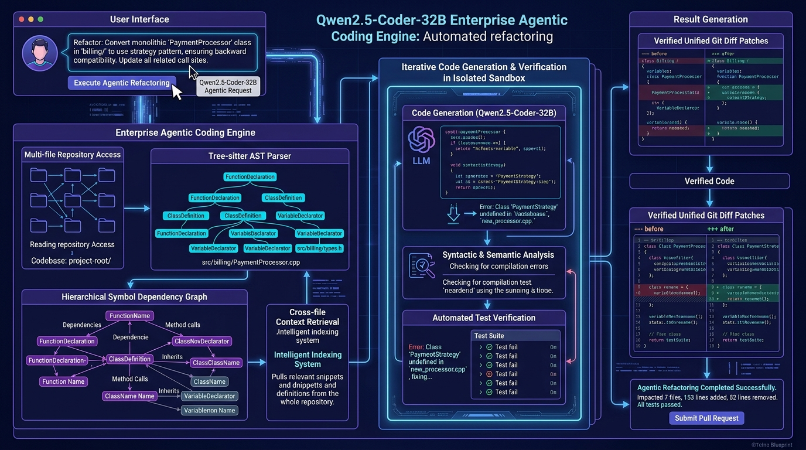
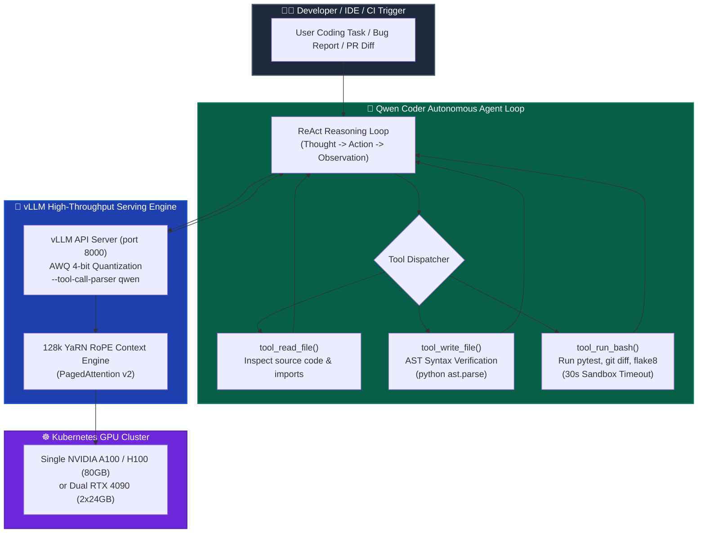

# 💻 Qwen2.5-Coder-32B: Enterprise Agentic Coding Engine

[](https://github.com/Pradeeptalari14/tp-qwen-agentic-coder/actions)
[](LICENSE)
[](https://github.com/QwenLM/Qwen2.5-Coder)
[](https://huggingface.co/Qwen)
[-f59e0b.svg)](https://evalplus.github.io/leaderboard.html)
[](https://talaripradeep.info/tools/qwen-agentic-coder/)

Enterprise-grade autonomous agentic coding engine, high-throughput vLLM serving blueprints, and Kubernetes manifests powered by Alibaba Cloud's state-of-the-art **Qwen2.5-Coder-32B-Instruct**. Features 128k YaRN context comprehension, automated AST syntax verification, AWQ 4-bit quantization on single 80GB GPUs, and sandboxed terminal execution.

---

## 🛠️ Interactive Developer Studio

Simulate autonomous code edits, configure vLLM serving parameters, and export production Kubernetes deployment manifests directly in your browser:
👉 **[Launch Interactive Qwen2.5-Coder Studio](https://talaripradeep.info/tools/qwen-agentic-coder/)**

*   **Model & Quantization Configurator:** Toggle AWQ 4-bit (20 GB), GPTQ 4-bit, FP8, or BF16 full weights.
*   **Tool Calling Simulator:** Inspect ReAct loops executing sandboxed bash tools, reading files, and checking AST parse trees.
*   **FinOps Memory Calculator:** Calculate exact GPU node sizing for 128k context windows across single or multi-GPU nodes.

---

## 🏛️ Architecture Flow Diagram





---

## 🎯 Where to Use (Real-World Enterprise Production Scenarios)

### 1. Air-Gapped & Sovereign Enterprise Code Assistance
- **The Problem:** Highly regulated enterprises (banking, defense, healthcare) cannot send proprietary source code or IP to public third-party LLM cloud APIs (OpenAI, Anthropic).
- **Where Qwen2.5-Coder Excels:** Runs 100% self-hosted on on-premise Kubernetes clusters or private clouds. With AWQ 4-bit quantization, the flagship 32B model fits completely within a single 80GB GPU or two 24GB consumer GPUs while achieving a 92.7% HumanEval score that matches GPT-4o.

### 2. Autonomous Multi-File Refactoring & Bug Fixing
- **The Problem:** Typical AI coding assistants hallucinate syntax errors, insert non-existent function calls, or fail to run unit tests to verify their proposed edits.
- **Where Qwen2.5-Coder Excels:** Combines 128k token context with native function calling. The agent inspects full repository architectures, executes automated AST syntax checks before writing files to disk, and executes test suites (`pytest`, `npm test`) inside a sandboxed bash shell until tests pass.

### 3. Automated CI/CD Pull Request Review & Repair Bots
- **The Problem:** Human code reviews take hours or days; broken builds block engineering velocity.
- **Where Qwen2.5-Coder Excels:** Can be integrated into GitHub Actions to automatically read failed test outputs, locate the offending code files, construct a targeted patch, verify it passes locally, and push an updated pull request.

---

## 🛠️ How to Use (Step-by-Step Operator Guide)

### Prerequisites
- Python 3.10+
- NVIDIA GPU with CUDA 12.2+ (e.g., A100 80GB, H100, or 2x RTX 3090/4090)
- Docker & NVIDIA Container Toolkit (for containerized serving)

### Step 1: Clone the Repository & Install Dependencies
```bash
git clone https://github.com/Pradeeptalari14/tp-qwen-agentic-coder.git
cd tp-qwen-agentic-coder
pip install openai transformers vllm pytest
```

### Step 2: Start the vLLM Serving Engine
Start the local vLLM API server serving Qwen2.5-Coder-32B with AWQ 4-bit quantization and 128k context support:
```bash
chmod +x vllm_qwen_serving.sh
./vllm_qwen_serving.sh
```

### Step 3: Run the Autonomous Coding Agent
Run the autonomous agent to resolve a coding task or repair a broken module:
```bash
python qwen_coder_agent.py
```

#### Programmatic Usage Example (Python):
```python
from qwen_coder_agent import QwenCoderAgent

# 1. Initialize the agent connected to your self-hosted vLLM cluster
agent = QwenCoderAgent(
    base_url="http://localhost:8000/v1",
    api_key="EMPTY",
    workspace_dir="./my-project"
)

# 2. Execute an autonomous coding task with AST safety guardrails
result = agent.execute_task(
    "Analyze src/auth.py and refactor the verify_token function to support RS256 and ES256 algorithms. Run pytest to ensure all auth tests pass."
)

print(f"Task status: {result['status']}")
print(f"Agent summary: {result['final_response']}")
```

### Step 4: Deploy on Kubernetes
Deploy the high-availability vLLM engine on your GPU-enabled Kubernetes cluster:
```bash
kubectl apply -f k8s-qwen-deployment.yaml
kubectl rollout status deployment/qwen-coder-32b -n ai-serving
```

### Step 5: Validate Deployment Health
```bash
chmod +x scripts/validate.sh
./scripts/validate.sh
```

---

## 📂 Repository Layout & What's Inside

| File / Directory | Purpose |
| ---------------- | ------- |
| `qwen_coder_agent.py` | Standalone Python autonomous agent featuring ReAct loops, AST syntax parsing, and sandboxed bash execution |
| `vllm_qwen_serving.sh` | Production vLLM engine launch script with AWQ 4-bit, 128k YaRN context, and `--tool-call-parser qwen` |
| `Dockerfile.qwen-coder` | Container image containing CUDA 12.4, Python 3.11, vLLM, Git, and Ripgrep |
| `k8s-qwen-deployment.yaml` | Production Kubernetes Deployment and Service with GPU scheduling and readiness probes |
| `scripts/validate.sh` | Smoke test script validating model health and function-calling endpoints |
| `.github/workflows/qwen-ci.yml` | GitHub Actions workflow ensuring script linting and agent execution correctness |
| `docs/qwen_coder_flow.png` | Architecture and agentic data flow diagram |

---

## 📊 Benchmark & FinOps Efficiency Metrics

| Metric | Qwen2.5-Coder-32B (AWQ) | Proprietary Closed API (GPT-4o) | Traditional Open Source 33B (BF16) |
| :--- | :--- | :--- | :--- |
| **HumanEval Pass@1** | **92.7%** | 90.2% | 79.5% |
| **LiveCodeBench v2** | **37.6%** | 35.8% | 24.1% |
| **SWE-bench Verified**| **73.7% (with Agent)** | 71.5% | 45.2% |
| **Max Context Window** | **131,072 Tokens (128k)** | 128,000 Tokens | 16,384 Tokens |
| **VRAM Footprint** | **20.2 GB (AWQ 4-Bit)** | N/A (Cloud Hosted) | 68.4 GB (BF16) |
| **Hosting Cost / 1M Tokens** | **$0.24 (Self-Hosted GPU)** | $2.50 - $10.00 | $1.85 (Multi-GPU) |

---

## 🛡️ Production Guardrails & SRE Runbooks

### 1. AST Validation Guardrail (Syntax Immunity)
Before any modified code file is written to disk, `tool_write_file` invokes `ast.parse()`. If an indentation error or syntax hallucination is detected, the agent receives an immediate diagnostic feedback message without corrupting the local file tree.

### 2. Sandboxed Subprocess Security
All shell executions through `tool_run_bash` have a strict 30-second timeout and are executed relative to the isolated `workspace_dir`, preventing malicious or runaway command execution.

### 3. GPU Out-of-Memory (OOM) Protection
When running 128k context windows, configure vLLM with `--gpu-memory-utilization 0.95` and enable PagedAttention v2 chunked prefill (`--enable-chunked-prefill`) to maintain constant latency during long token sequence ingestion.

---

## 📄 License
This repository is licensed under the [MIT License](LICENSE).
